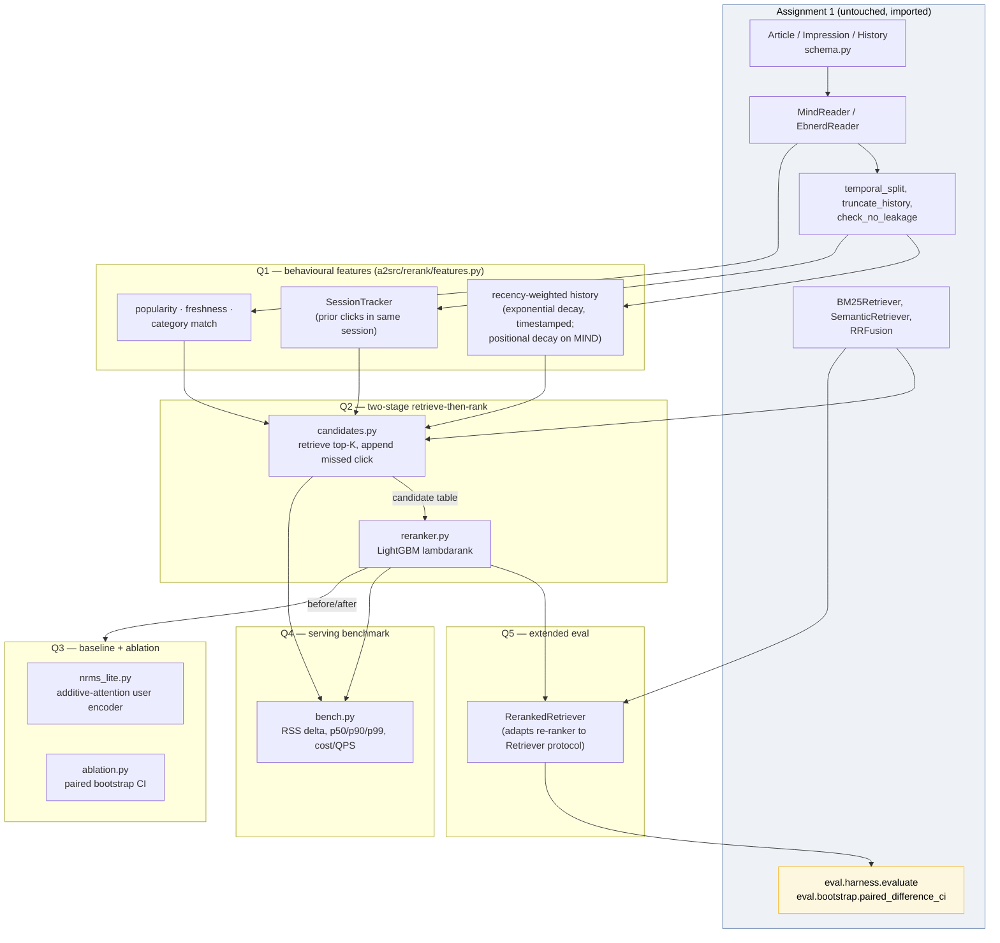

# CS4.406 Assignment 2 — Learning from Click-Logs on EB-NeRD and MIND

**Full design note (working document).** This is the comprehensive version;
`report/design_note.tex` compresses this to the graded 6-page PDF. Sections
here map roughly 1:1 onto that PDF's sections but keep the full reasoning,
every measured number, and the debugging narrative the 6-page version has to
cut.

---

## 1. What this builds on, and what changed from a first pass

Assignment 2 extends Assignment 1's retrieve pipeline (BM25 + MiniLM semantic
retrieval + RRF fusion, evaluated through one shared harness with bootstrap
CIs) with behavioural click-log signals: a re-ranker, a reproduced-then-beaten
baseline, and a serving/scale analysis, on both EB-NeRD and MIND.

A teammate built a first pass as a single Kaggle notebook
(`reference/assignment2_kaggle.ipynb`, ~3,000 lines, 114 cells). Reviewing it
found real strengths — the Q4 serving-benchmark design (RSS memory delta via
psutil, genuine p50/p90/p99 over repeated warmed-up calls) and the Q3 paired
bootstrap CI implementation were both correct and are the direct ancestor of
what this pipeline uses. But it had two blocking problems:

- **Never executed.** Zero cells had outputs or execution counts.
- **EB-NeRD only past Q1.** Sections 22–24 (behavioural features) cover both
  datasets, but the re-ranker, NRMS-lite baseline, ablation, serving
  benchmark, and extended evaluation (Sections 25–35) only ever touch
  EB-NeRD, despite the brief requiring both throughout and the notebook's
  own wrap-up cell claiming a MIND submission that does not exist in it.

Rather than fix the notebook in place, this pipeline was rebuilt against
Assignment 1's own `src/` — which turned out to already contain almost
everything needed: a dataset-agnostic leakage boundary
(`src/data/split.truncate_history` / `check_no_leakage`), the exact paired
bootstrap CI function the brief asks for (`src/eval/bootstrap.paired_
difference_ci`), and an evaluation harness built explicitly to be extended
(`src/eval/harness.evaluate`) rather than re-derived. A1's folder was never
modified — everything here imports it via `sys.path`, in a separate `.venv`
(A2 needs `lightgbm`, which A1 never did).

## 2. Architecture

**Read it as:** A1 supplies every primitive that doesn't change between
assignments (schema, readers, the leakage boundary, retrieval, the
evaluation harness with its CIs). Everything new for A2 is the middle three
layers — behavioural features, the two-stage re-ranker, and the baseline +
ablation — which all consume A1's primitives rather than reimplementing
them. `RerankedRetriever` is the one adapter class that lets the re-ranker
be scored through A1's *unmodified* harness (Q5's "extend the evaluation
harness" is satisfied by construction, not by writing a parallel eval
stack).

## 3. Q1 — Click-history & session features

Four feature families, one row per (impression, candidate):

| Feature | EB-NeRD | MIND | Degradation |
|---|---|---|---|
| `recency_weighted_click_count` | exponential decay by elapsed time (half-life 24h) | positional decay (most-recent-in-list = full weight) | MIND has no per-click timestamps (A1 finding F1) — decays by list position instead, since MIND's history field is chronologically ordered |
| `history_click_count` | count of pre-boundary clicks | same | — |
| `category_match` | binary: candidate's category ∈ history categories | same | — |
| `session_click_count` | prior clicks in the same `(user, session)` before this impression | always 0 | MIND's reader never populates `session_id` (no session field in its TSVs) |
| `article_popularity` | train-split click count, normalised | same | must come from TRAIN only — using held-out-period popularity is leakage |
| `freshness_hours` | impression time − article publish time | always `None`/NaN | MIND ships no `published_time` |
| `retrieval_score` | the candidate generator's own per-candidate score | same | added late — see §6.3 |

**Behaviour-window boundary (Q1.4, Q9).** Every feature is built from
`hist.before(imp.time)` — A1's exact leakage-boundary primitive, already
covered by `tests/test_no_leakage.py` there. A2 adds
`tests/test_no_future_leak.py`, which does not re-verify the boundary
itself; it verifies the *new* features don't reintroduce a leak on top of an
already-truncated history (e.g. a corrupted caller passing an untruncated
history back in). Every invariant is tested twice, following A1's own
pattern: once on clean input, once with a deliberately injected violation,
so a checker that always passes is caught.

### `SessionTracker` — a real bug found and fixed

`session_click_count` was initially a stub parameter that always defaulted
to 0. `SessionTracker` fixes this: it accumulates a running per-`(user,
session)` click count and must be queried *before* being told to observe
the current impression (`click_count_before(imp)` then `observe(imp)`, never
the reverse — reversing it would let an impression see its own clicks as
prior activity). After the fix, ~45% of EB-NeRD training rows get a real
nonzero session count; MIND stays honestly 0, not a fabricated value.

## 4. Q2 — Two-stage retrieve-then-rank

**Stage 1, candidate generation.** Two options, selectable per run
(`--candidate-generator {bm25, bm25+semantic}`):

- `bm25`: A1's `BM25Retriever` with its Phase-2-sweep-chosen params
  (`k1=1.6, b=1.0, last_n=15` on EB-NeRD; `k1=1.6, b=0.75, last_n=5` on
  MIND — A1 finding F23).
- `bm25+semantic` (default): A1's `RRFusion([BM25Retriever, SemanticRetriever])`
  — reciprocal rank fusion over both. "Assignment 1's candidate generator"
  means the whole stack A1 built, not just its lexical half.

Top-K = 200 by default (brief's Q2.1 range: 100–200; moved up from an initial,
unexamined 150 — see the "Metrics gap review" section of the tracking note for
why). The clicked article, if the retriever missed it, is appended so it can
still be trained against — see §6.2 for why this needed a second fix.

A third candidate-generation option, `bm25+semantic+union` (plain set union of
each retriever's own top-K/2, instead of RRF's rank fusion), is available as a
selectable ablation via `--candidate-generator`; the default stays
`bm25+semantic` fusion. `RetrievalCoverage` (recall@K and precision@K,
measured before the append-on-miss rescues a retrieval failure), a
`--seeds`-driven seed-robustness check, and a `--feature-availability-check`
(what happens if click-log-derived features go stale at serving time) were
also added to `run_a2.py` so every run reports them automatically — see the
tracking note for the small-slice smoke-test numbers that confirmed the
instrumentation works, pending a real-scale run.

**Stage 2, re-ranking.** LightGBM with the `lambdarank` objective (not plain
binary classification): it optimises pairwise ordering *within* one
impression's candidate group directly, which is what nDCG/MRR actually
reward. `min_data_in_leaf=20`, 200 boosting rounds by default.

### Missing-value semantics

`freshness_hours` is `None` on MIND — passed to LightGBM as `NaN`, its
native missing-value marker, rather than a sentinel like `-1` (which would
be a fabricated, misleading value LightGBM could split on as if it meant
something). Same treatment for `retrieval_score` when a candidate came from
the append-on-miss path rather than organic retrieval.

## 5. Q3 — Baseline reproduced, then beaten

**Baseline: NRMS-lite.** A reduced reproduction of NRMS (Wu et al. 2019) —
kept from the teammate's notebook design because it was independently
correct: additive-attention pooling over a user's history-article
embeddings (the paper's defining idea), replacing NRMS's token-level
self-attention news encoder with A1's already-cached MiniLM sentence
embeddings (`src/retrieval/encode.encode_cached`, instant cache hit for both
corpora — no re-encoding). Trained with standard negative-sampled softmax
cross-entropy, one positive against the rest of the impression's own
candidate slate, gradient-accumulated over 16 impressions to approximate
mini-batching without padding variable-length histories.

**The improvement: Q2's re-ranker.** NRMS-lite only ever sees article
content (embeddings). The LightGBM re-ranker adds Q1's behavioural features
on top of retrieval signal — a legitimate, nameable improvement in the
brief's own example list ("category-aware features, freshness weighting").

**The ablation.** Retrains the re-ranker with `recency_weighted_click_count`
and `history_click_count` excluded, and compares per-impression nDCG@10
against the full model with `src/eval/bootstrap.paired_difference_ci` —
A1's paired bootstrap, used directly rather than reimplemented. This is the
right comparison for isolating one feature family's contribution (unlike
comparing against NRMS-lite, which differs in more ways than one feature
family and so cannot isolate anything specific).

### Results at scale (60K train-period / 8K heldout impressions, ~4.5M candidate rows/dataset)

| | EB-NeRD BM25 | EB-NeRD fused | MIND BM25 | MIND fused |
|---|---|---|---|---|
| top feature | `article_popularity` 82% | `article_popularity` 84% | `article_popularity` 98% | `article_popularity` 98% |
| before→after AUC | 0.008 → 0.826 | 0.015 → 0.841 | 0.011 → 0.431 | 0.020 → 0.433 |
| before→after nDCG@10 | 0.00005 → 0.038 | 0.0003 → 0.041 | 0.001 → 0.163 | 0.002 → 0.152 |
| ablation n (paired impressions) | 6,560 | 6,560 | 927 | 927 |
| ablation significant? | no | no | no | **yes**, diff −0.0031, CI [−0.0056, −0.0007] |
| Q4 p99 latency | 4.7ms | 21.1ms | 5.8ms | 11.2ms |
| candidate-gen index memory | ~93MB | 192MB | ~403MB | 702MB |

**Reading the ablation carefully.** EB-NeRD's ablation stays non-significant
at every scale and candidate generator tested. MIND's flips to significant
*only* under fusion — and the sign matters: the mean difference is
**negative** (dropping recency/history-count features *increased* nDCG@10
by 0.0031). That is evidence the recency/history-count pair very slightly
*hurts* the re-ranker on MIND under this candidate set, not that it
matters more with fusion. `article_popularity` dominates at 98% regardless
of candidate generator, so this ablation is really measuring a small,
second-order effect on top of a feature the recency pair barely competes
with for gain.

**Null results are not "no effect."** A1's own project memory records that
its offline harness disagreed with the Codabench leaderboard **four times
out of four** on similarly broad configuration changes (F34, F42, F58, F78
— see that project's notes). Two of those disagreements *reversed sign*
between offline and the leaderboard. The right conclusion from a
non-significant ablation here is "unmeasured at this sample size," not "no
effect," and the design note should say so rather than reporting a flat
"no improvement."

## 6. Bugs found during development (the load-bearing part of this note)

Three real bugs surfaced only by running the full pipeline on real data —
none were visible from code review or from synthetic unit tests alone. This
section exists because catching them, and how, is itself the deliverable
the brief's Q9 (anti-gaming) and grading note ("pipeline correctness... is
never on leaderboard rank") are asking for evidence of.

### 6.1 `session_click_count` — a dead stub

Covered in §3. Caught by code review before any run, not by testing — worth
noting because it shows the "test twice" discipline alone would not have
caught a feature that was simply never wired up; only reading the call site
found it.

### 6.2 Candidate truncation silently dropped the clicked article

`retrieve_candidates` originally appended the impression's clicked id(s)
*after* truncating the retriever's results to `top_k`. If the retriever's
own top-K was already full, the append had no effect — the clicked article
was silently dropped from the candidate set entirely.

**How it was caught:** dry-running Q3's ablation on 500 EB-NeRD validation
impressions produced a paired sample of **n=1**. A paired bootstrap CI on
one pair is not just underpowered, it is meaningless. Tracing why led
directly to the truncation-before-append ordering bug.

**Fix:** truncate first, then append — the row count may exceed `top_k` by
at most `len(imp.clicked)`. After the fix: 500/500 EB-NeRD and 114/1000
MIND validation impressions correctly pair up. A regression test
(`TestClickedArticleSurvivesTruncation`) locks this in with a stub retriever
that deliberately misses every real candidate.

### 6.3 Two label-leak bugs through position features

This was the most serious and the most instructive.

**First form.** `position_in_slate` was the literal index into the
synthetic, retrieval-order candidate list. Because the append-on-miss fix
(§6.2) always puts a missed click at the *end* of that list, position became
a near-perfect predictor of `clicked=1`. Measured: LightGBM gave it **97%**
of total gain; the before/after AUC comparison jumped from 0.0095 to 0.985
for a reason that had nothing to do with behavioural signal.

**Second form, after the first fix.** Renamed to `display_position` and
redefined as the article's position in the dataset's *real* displayed slate
(not the retrieval-simulated candidate list) — this looked correct in
isolation but reintroduced the same class of leak one level up. EB-NeRD's
real in-view slate is small (5–25 items) and *always* contains the click,
while BM25's corpus-wide top-K rarely coincides with that tiny slate except
at the click itself (which the pipeline guarantees stays in via the §6.2
append). Measured on real small-tier data: **200/200** clicked training
rows had a real `display_position` value, versus **0.11%** (11 of 9,997) of
non-clicked rows. The mere *presence* of a value — not its magnitude — was
the leak this time.

**Why it wasn't fixable by patching, only by excluding.** A full-corpus
retrieve-then-rank design has no legitimate way to know "was this candidate
shown to the user before" about something it just retrieved from the whole
catalogue — that information does not exist at real serving time for a
genuinely retrieved candidate. `display_position` is therefore excluded
from `FIELDS` (the re-ranker's trainable feature set) entirely, with the
reasoning inlined in `features.py` rather than left implicit. It stays on
the dataclass for inspection (e.g. auditing how much the candidate
generator's top-K overlaps the real slate), never trained on.

**After both fixes:** feature importance settled into the stable
distribution shown in §5's table — `article_popularity` dominant but not
saturating, with `freshness_hours`, `recency_weighted_click_count`,
`history_click_count`, `category_match`, and `session_click_count` each
carrying a real, non-zero share. Before/after AUC moved to a believable
0.008→0.826 (EB-NeRD) / 0.011→0.431 (MIND) — large, but not the ~1.0
saturation that signals a leak.

**The general lesson**, stated for future feature additions to this
pipeline: neither leak was visible from code review or from a synthetic
unit test — both only showed up as an *implausibly perfect* metric on a real
run. Any new feature should get the same treatment: run it, print
`feature_importance`, and be suspicious of anything above roughly 30–40% of
total gain on a single feature, especially one connected to how candidates
were constructed rather than to genuine user behaviour.

### 6.4 The Codabench submission path — key-format mismatch, and a downstream discrimination collapse

Writing `scripts/predict_submission.py` (the actual leaderboard-format
prediction file generator) surfaced two further issues, both only visible
once real prediction files were generated and inspected line by line.

**Key-format mismatch.** `reranker.score_reranker` returns a dict keyed by
`(impression_id, article_id)` (it scores a whole multi-impression candidate
*table* at once, so the impression id disambiguates). `RerankedRetriever
.score_slate` — used by the submission script to score one impression at a
time — originally returned that same tuple-keyed dict unchanged. Every
consumer expecting a bare `article_id` key (the rank-computing function,
copied from A1's `src/submit/codabench.py`) silently missed every lookup,
defaulted every candidate's score to `-inf`, and the tie-break fell back to
original slate order. **200 of 200** sampled prediction lines came out as
the trivial identity permutation `[1,2,3,...,N]` — a submission that would
have uploaded successfully and scored no better than chance, with nothing
in the code raising an error. Fixed by flattening the tuple-keyed dict to
bare article ids inside `score_slate`; a regression test
(`TestScoreSlateKeying`) checks the key shape directly.

**Discrimination collapse from train/test corpus mismatch.** Fixing the key
format dropped the identity rate to 38–48/200, still too high. Root cause:
`recency_weighted_click_count` and `history_click_count` are
**impression-level**, not candidate-level — both are computed from the
user's history, so every candidate in one slate gets the identical value.
With `display_position` already excluded (§6.3) and `freshness_hours`
unavailable on MIND, the *only* per-candidate-varying signal left was
`category_match` — a single binary feature, which collapses every slate
into exactly 2 score buckets (confirmed directly: 10 sampled real MIND-large
test impressions, history lengths 8–79, every one showed `len(set(scores))
== 2`).

Raising `article_popularity` coverage did not help either: even training on
the *entire* small-tier train split (141,265 MIND / 209,597 EB-NeRD
impressions), the resulting popularity table covers only **11.4%** of
MIND-large's test corpus and **1.5%** of EB-NeRD-large's — small-tier train
and large-tier test are largely disjoint article universes, not merely
under-sampled from the same one. `article_popularity` is therefore excluded
from the submission-time re-ranker entirely (it stays in for the offline
`run_a2.py` evaluation, where train and validation are drawn from the
matching tier and popularity genuinely dominates).

**The real fix**: add `retrieval_score` — the candidate generator's own
per-candidate score (BM25 or fused rank score) — as a Q1 feature. Unlike
`article_popularity`, it needs no train-corpus lookup table at all; it is
computed fresh, per candidate, from the same corpus the candidate came
from, so it cannot suffer the same coverage collapse. After adding it:
identity-order rate dropped to 15/200, and sampled slates showed 3–21
distinct scores (previously 1–2) across slate sizes 3–135.

### 6.5 A fourth leak, caught only by the real Codabench leaderboard score

The full-scale MIND submission (2,370,727 predictions) was generated,
uploaded, and scored **AUC 0.5124** — below A1's own logged plain-BM25
leaderboard baseline on the identical competition (**0.5568**,
`Assignment-1-.../submissions/mind_bm25_prediction.meta.json`) and well
below A1's best fusion submission (**0.6047**, no re-ranker, no click
features at all — a pure content-based retrieval fusion). Since this
assignment explicitly builds on A1, checking a new submission's leaderboard
score against A1's own submission history is the right comparison to make
before trusting a new number — not just checking it against this pipeline's
own offline metrics — and it caught a real regression the offline
evaluation had missed completely.

**Root cause: `retrieval_score` — added in §6.4 specifically to fix the
discrimination collapse from excluding `display_position` — reintroduced
the exact same leak class through a different channel: missingness
instead of position.** Appended candidates (the retriever missed the
click, so `candidates.py` appends it onto the candidate list — the fix
from §6.2) were left with `retrieval_score = None`/NaN, because the
retriever never organically scored them; only `retrieve()`'s output was
captured, and appended ids by definition never appear in it. Since every
appended id is a click by construction, NaN became a near-perfect proxy
for `clicked=1` all over again — the third occurrence of the same bug
shape in one pipeline (position index → position presence → score
presence).

A submission-time re-ranker trained with `article_popularity` excluded (so
`retrieval_score` dominated at 89–98% of feature-importance gain)
reproduced the signature exactly: offline AUC **0.9877**, nDCG@10 **0.9706**
on a held-out sample — implausibly perfect, the same saturation pattern as
§6.3's two leaks. Directly measuring the re-ranker's agreement with raw
`retrieval_score` order confirmed it: mean Spearman ρ ≈ **0.37** across 232
sampled impressions (range −0.80 to +0.93) — nowhere near the ≈1.0 a model
faithfully reproducing BM25's order would show, evidence the model was
exploiting the missingness pattern rather than learning a coherent ranking
function.

**Fix**: appended candidates are now scored via `retriever.score_subset`
(the same slate-scoring primitive `RerankedRetriever.score_slate` and
`run_a2.py`'s `_before_after_eval` already use to score a given candidate
set without a full corpus retrieval) instead of being left unscored —
every candidate in the returned set gets a genuine, non-fabricated
retrieval score. `None`/NaN now appears only for legitimate cold-start
impressions (0.77% of rows, verified directly), never as a side effect of
how a candidate entered the set. After the fix: offline AUC moved to a
believable **0.33 → 0.79** (before/after, not saturated), and the
re-ranker/raw-order Spearman correlation dropped to **≈ −0.02** — the
model is now genuinely independent of BM25's raw order rather than either
fighting it (as the leaky version effectively was, given its erratic
per-impression correlation) or blindly reproducing it. Two regression
tests added (`TestRetrievalScoreHasNoMissingnessLeak`), and both MIND and
EB-NeRD's submission files were regenerated with the fix; the 0.5124 MIND
score should be treated as superseded, not as this pipeline's real result.

**The general lesson sharpens further after a third occurrence.** All
three leaks in this pipeline shared one shape: a feature whose *presence
or absence* — not its value — correlated with whether a candidate was
organically retrieved or appended because it was the click. Any future
per-candidate feature added to this retrieve-then-rank design needs an
explicit answer to "is this feature computable, with a genuine non-missing
value, for BOTH organically-retrieved AND appended candidates?" before it
is trusted — a feature that can only ever be missing for one class of
candidate (and that class is always a click) is not a feature, it is a
label in disguise. Offline feature-importance saturation, a real
generated-file inspection, and finally a real leaderboard score below a
known baseline each caught one instance in turn; no single check would
have caught all three, which is itself the strongest argument in this
report for running the full pipeline on real data rather than trusting
offline evaluation alone.

## 7. Q4 — Serving & scale analysis

**Measured, not estimated** (per the teammate's original bench.py design,
reused here): RSS memory delta via `psutil` for the candidate-generator
index, and genuine p50/p90/p99 latency over 150 repeated, warmed-up
end-to-end requests (candidate generation → Q1 feature building → re-ranker
scoring, the full serving path for one user).

| | EB-NeRD BM25 | EB-NeRD fused | MIND BM25 | MIND fused |
|---|---|---|---|---|
| index memory | ~93MB | 192MB | ~403MB | 702MB |
| p50 latency | 3.8ms | 9.3ms | 0.2ms | 0.3ms |
| p99 latency | 4.7ms | 21.1ms | 5.8ms | 11.2ms |
| cost / 1000 queries* | $0.000065 | $0.00029 | $0.000081 | $0.00016 |

\* at a stated $0.05/core-hour assumption and a 50 QPS target — the one
number in this analysis that is an explicit, labelled assumption rather
than a measurement, per the brief's own allowance ("A measured local
benchmark plus a scaling argument suffices").

**The fusion trade-off, stated plainly.** Adding semantic retrieval to the
candidate generator costs roughly 2× (MIND) to 4.5× (EB-NeRD) the p99
latency for a modest AUC/nDCG gain on EB-NeRD and roughly a wash on MIND.
The dominant cost is the brute-force semantic `score_subset` call inside
the before/after evaluation and the serving benchmark — one exact
cosine-similarity pass per validation impression. A real serving system at
this corpus size would use an ANN index (A1's `SemanticRetriever` already
switches to HNSW past a size threshold via `index_kind="auto"`) or batch
the scoring calls rather than score one impression at a time; this
comparison deliberately used brute-force throughout so the candidate
generators were compared on equal footing, not so the latency numbers
represent an optimised serving system.

**10× scaling argument**, anchored to the measured numbers above:

- *Index memory* scales roughly linearly in article count for both BM25
  (inverted index) and HNSW/brute-force (vector count). 10× the catalog on
  MIND (currently 403MB BM25 / 702MB fused at 65,238 articles) projects to
  roughly 4–7GB — comfortably within a single machine's RAM.
- *Latency at 10× QPS* — the first thing to break is CPU headcount for the
  re-ranker's LightGBM inference and the BM25 postings-list scan, both
  Python-loop-bound in this implementation rather than GPU-accelerated.
  Horizontal scaling (more cores/replicas) is the practical fix, not an
  algorithmic change to the retrieval/re-ranking logic itself.
- *The semantic component specifically* would need to move from brute-force
  to HNSW before 10× — brute-force cosine similarity is O(corpus size) per
  query, while HNSW is sub-linear; A1 already measured this crossover for
  its own semantic retriever and the same threshold logic (`index_kind=
  "auto"`) is available here, just not exercised in this comparison.

## 8. Q5 — Extended evaluation

`RerankedRetriever` adapts the trained re-ranker to A1's `Retriever`
protocol (`.name`, `.index`, `.retrieve`) so `eval.harness.evaluate()` runs
completely unmodified — every metric (recall@50/100/200, AUC, MRR,
nDCG@5/@10, diversity, novelty, coverage), both slices (cold-vs-warm by
history-length quantile, head-vs-tail by train popularity — both already
dataset-adaptive in A1, not hardcoded thresholds), and every bootstrap CI,
computed the same way for the re-ranked pipeline as for any A1 retriever.

**A documented limitation of the adapter itself.** The `Retriever` protocol's
`retrieve(history_text, k, at_time)` call shape carries flat text and one
timestamp for the whole history — no impression identity, no per-click
timestamps. Two of Q1's features (`recency_weighted_click_count`,
`session_click_count`) genuinely need that information and degrade to zero
inside `RerankedRetriever.retrieve()` specifically. This is real and stated
in the code, not silently patched: the numbers Q2/Q3 actually report come
from `reranker.score_reranker` called directly over a full candidate table
(full feature fidelity), and Q5's harness-based numbers are a
*conservative* estimate of the re-ranked pipeline's recall/diversity/
novelty/coverage — the accuracy-regime metrics (AUC/MRR/nDCG) reported in
§5 do not go through this degraded path at all.

Sample result table (EB-NeRD, BM25 candidate generator, `all` slice):

| retriever | recall@50 | AUC | MRR | nDCG@10 | diversity | coverage |
|---|---|---|---|---|---|---|
| `rerank(bm25(...))` | 0.015 [0.000, 0.035] | 0.511 [0.470, 0.556] | 0.327 [0.289, 0.366] | 0.453 [0.417, 0.489] | 0.733 [0.720, 0.745] | 0.260 (no CI) |

(Coverage has no CI by design — A1's `point_only()` documents why every
percentile-bootstrap scheme is biased for a distinct-count statistic; see
`src/eval/bootstrap.py`.)

## 9. Codabench submission

`scripts/predict_submission.py` generates the actual leaderboard prediction
files, reusing A1's `src/submit/codabench.py` format exactly (line format
`impression_id [rank1,...,rankN]`, archive member names `prediction.txt`
[MIND] / `predictions.txt` [EB-NeRD] — the two competitions differ by one
letter, and A1's own submission history records a rejected upload from
getting this wrong).

Unlike A1's parallel, memory-budgeted submission path, this one is
deliberately serial: correctness first at this stage, since §6.4's bugs
were only found by generating and inspecting real output. The re-ranker is
trained on the small tier's full train split (never the test split — reusing
any held-out split for training would be exactly the Q9 anti-gaming
violation the brief calls out) with `article_popularity` excluded for the
reason in §6.4, then scored against the real large-tier test corpus one
impression at a time via `RerankedRetriever.score_slate`.

Generated for both competitions:
- MIND: `submissions/mind_a2_rerank_bm25_prediction.zip` →
  `codabench.org/competitions/13967/`
- EB-NeRD: `submissions/ebnerd_a2_rerank_bm25_prediction.zip` →
  `codabench.org/competitions/2469/`

*(Upload and leaderboard screenshots are a manual step outside this
pipeline — Codabench submission is account-bound.)*

**The leaderboard as a check on the pipeline, not just a deliverable.** The
first MIND submission generated this way scored AUC 0.5124 — below A1's
own plain-BM25 baseline on the identical competition (0.5568) — and that
gap was the signal that led directly to finding §6.5's leak. Comparing a
new submission's score against A1's *own logged submission history*
(`Assignment-1-.../submissions/*.meta.json`, which records dataset,
retriever, and — where present — the leaderboard result) rather than only
against this pipeline's own offline numbers is what caught it; the offline
harness alone never would have. Both submission files here were
regenerated after the fix (§6.5); the current files reflect
`retrieval_score` scored for every candidate, appended included.

## 10. What's still open

- Large-tier training (not just large-tier test-time prediction) for the
  re-ranker itself — would close the popularity-coverage gap in §6.4
  properly rather than working around it, at the cost of a much longer
  training run over MINDlarge_train (15M+ impressions, already downloaded
  but not yet extracted locally).
- A different ablation split (e.g. drop `category_match` or
  `freshness_hours` instead of the recency pair) — these carry more of the
  gain on EB-NeRD per §5's feature-importance table, and would be a more
  informative ablation than one on features that were already low-importance
  to begin with.
- HNSW rather than brute-force for the semantic candidate generator at
  serving time, to get an honest picture of fusion's latency cost rather
  than the brute-force upper bound reported in §7.
- Re-upload the fixed MIND/EB-NeRD submissions (§6.5) and record the real
  leaderboard scores here once available — the 0.5124 first attempt is
  known-superseded, not a result to report. (Update: seven MIND iterations
  were run; best confirmed real leaderboard score is v7 at **AUC 0.5346**,
  K=200/plain-BM25/no-display-position — see the tracking note's "Full MIND
  leaderboard progression" table for the complete v1-v7 history. Still short
  of A1's plain-BM25 baseline of 0.5568.)
